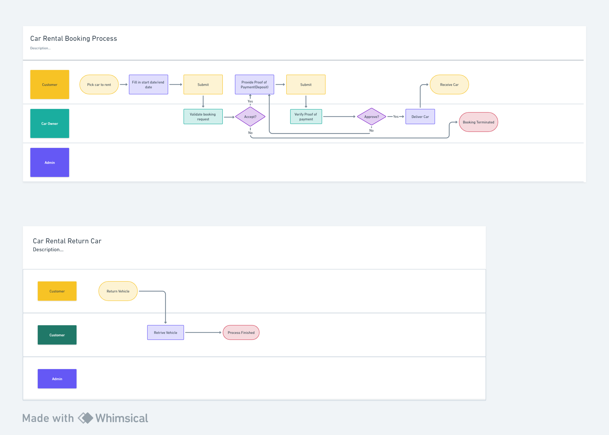

# Car Rental App
## Scope
<p>Basic car rental app that has the basic flow of booking car from start(Complete Boking) until finish(Return Car)</p>

## Tech Used
- Stack
    - [Laravel](https://laravel.com) + Laravel Breeze
    - [InertiaJS](https://inertiajs.com/)
    - [VueJS](https://vuejs.org/)
    - [TailwindCss](https://tailwindcss.com/)
- Tool
    - [Laragon](https://laragon.org/index.html)
    - [VSCode](https://code.visualstudio.com/)
    - [MailPit](https://github.com/axllent/mailpit), for testing Email notification.

## Setup
1. Clone this repo
2. Duplicate ```.ev.example``` to ```.env```
3. Create database name ```car-rental```
4. Open CLI tool in the project directory(car-rental-app) after cloned from No.1 finished
5. Run the following command:
    - `` composer install ``, download necessary packages used.
    - `` php artisan:key generate``
    - `` php artisan migrate --seed``, generate database tables and dummy data.
    - `` npm install && npm run dev``
6. Update the following var in **.env** to enable email notification, make sure MailPit(or other smpt provder) running to avoid errors. Check [here](https://pen-y-fan.github.io/2023/02/23/how-to-install-mailpit-in-laragon/) on how to add MailPit to Laragon
```
EMAIL_NOTIFICATION = true
```

## Role
| Role | Description | Account(Email/Password) |
|----|----|----|
| Customer| User that seek rental car| **customer@car-rental.dev/password**|
| Owner| User that register vehicle for rent, process rental request| **owner@car-rental.dev/password**|
| Admin | View the registered users and the app details (Currently)| **admin@car-rental.dev/password**|
## Booking Process Flow

